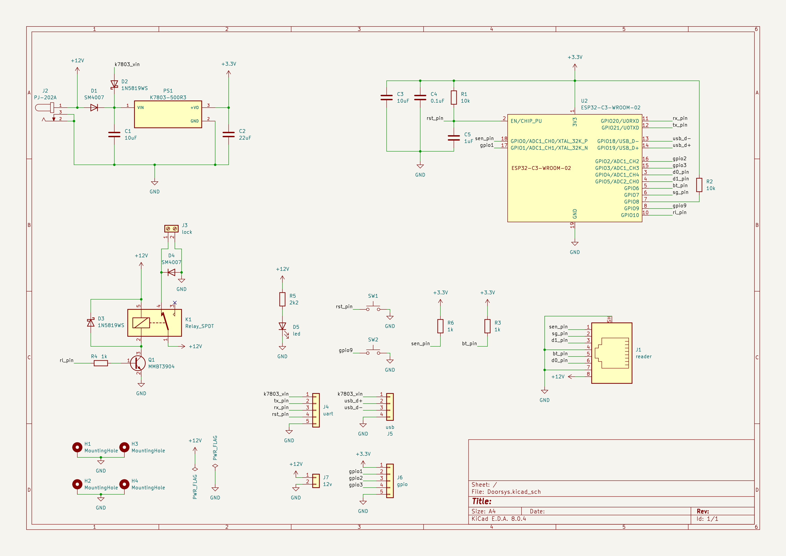
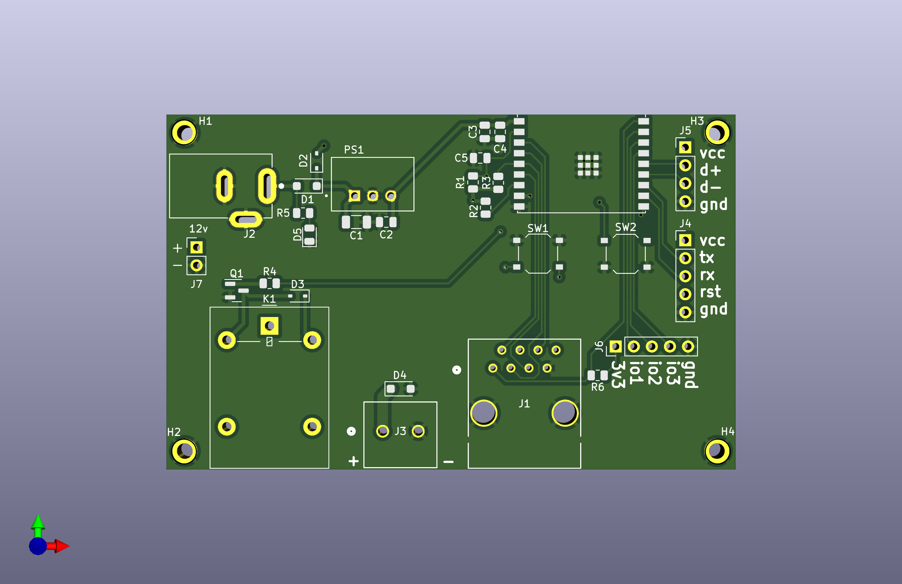
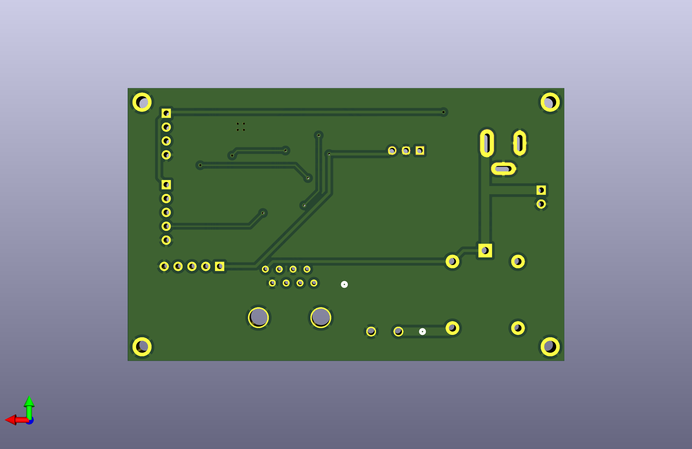
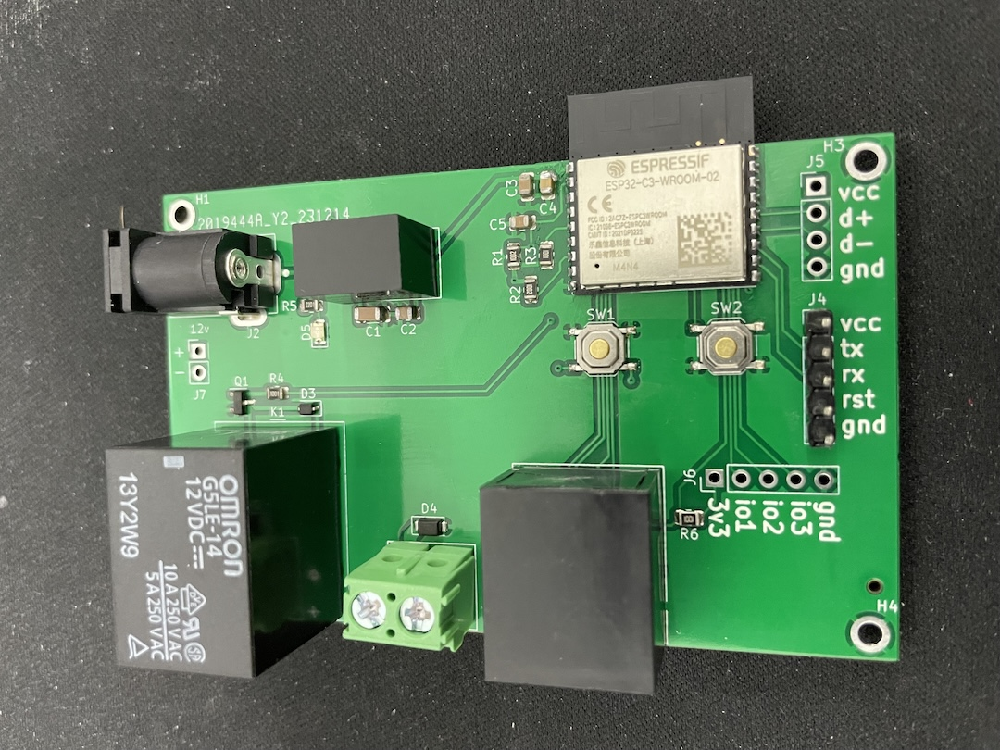
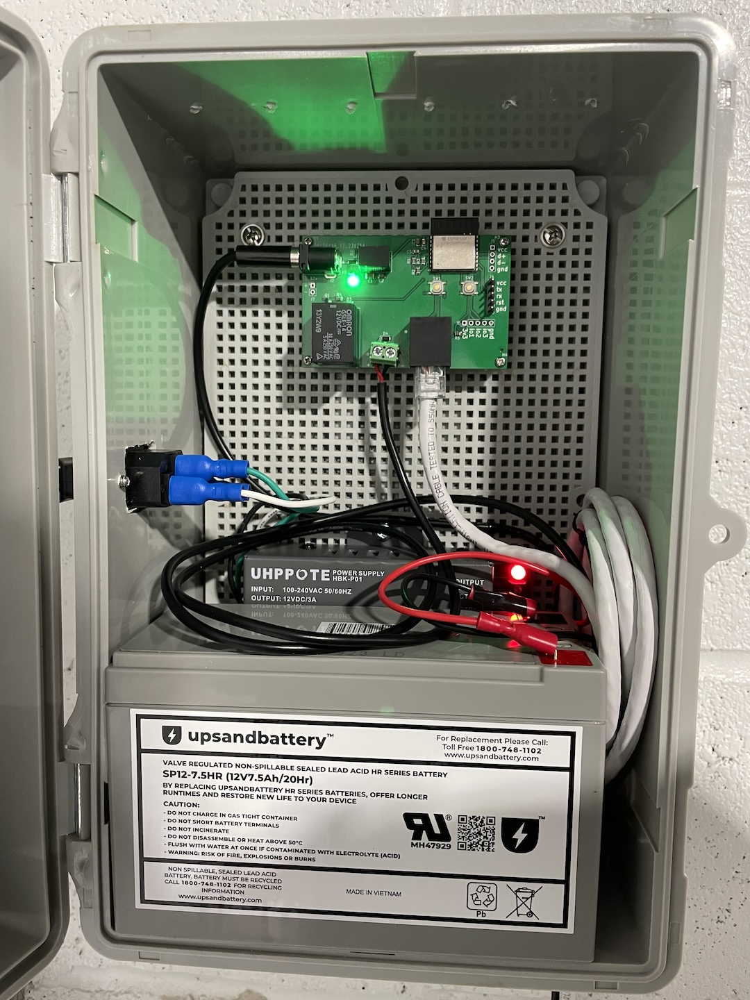

<!-- vim: set tw=80: -->

# Doorsys Hardware

This repo contains the designs for the custom PCB for the doorsys device.

Earlier versions of this project used a esp32 relay board and a soldered
protoboard. That wasn't very clean as you can see in the [pictures](#pictures).

## Schematics

After transitioning from the esp32 chip in favor of the esp32-c3 for better
compatibility with rust (esp32-c3 is based on the RISC-V architecture) a custom
board was necessary.

This board design is based on the reference implementation provided by the
esp32-c3 wroom module [datasheet](https://www.espressif.com/sites/default/files/documentation/esp32-c3-wroom-02_datasheet_en.pdf)
.

### Important remarks

- A DCDC regulator is used to drop the voltage from 12v used by the door lock to
  the 3v3 used by the esp chip
- The onboard relay is driven by a transistor and contains flyback diodes to
  manage the voltage spikes coming from the lock
- GPIO 4 and 5 are connected D0 and D1 respectively hey on the keypad
- GPIO 10 is connected to the relay for door activation
- Headers for the uart and usb ports are available
- Extra gpios are available on optional header pins

> [!WARNING]
> Spec wise the esp32 family is not 5v logic tolerant. But there's lots of [chatter](https://www.letscontrolit.com/forum/viewtopic.php?t=8845)
> on the internet claiming otherwise though. I've been using 5v straight to the gpio
> pins to connect the wiegand keypad for a while without issues but caveat emptor

## PCB

Here is the PCB design

## Pictures

Prototype board using esp32

PCB fully assembled

New PCB installed and running

