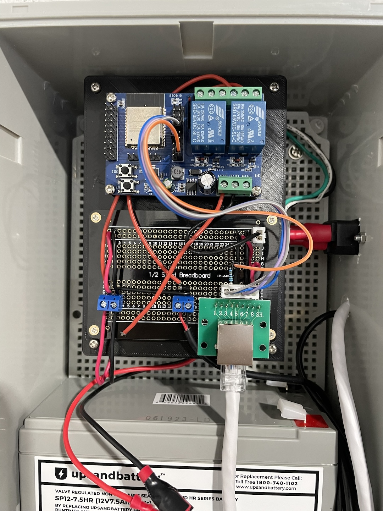

<!-- vim: set tw=80: -->

# Doorsys Hardware

This repo contains schematics, hardware breakdown, and designs for the custom
PCB for the Doorsys device.

Earlier versions of this project used a ESP32 relay board and a soldered
protoboard. That wasn't very clean as you can see in the [pictures](#pictures)
section.

## Overview

The ESP32 is connected to a relay using GPIO in order to operate the 12v based
magnetic lock. A [wiegand](https://en.wikipedia.org/wiki/Wiegand_interface)
keypad is also connected to the ESP32 using 2 GPIO ports. A 12v PSU with an
external 12V battery was added for continuous operation in face of a power
outage. More information, schematics, and PCB design can be found on the
[doorsys-hardware](https://github.com/fabiojmendes/doorsys-hardware) repository.

## Block diagram

## Schematics

After transitioning from the ESP32 chip in favor of the ESP32-C3 for better
compatibility with rust (ESP32-C3 is based on the RISC-V architecture) a custom
board was necessary.

This board design is based on the reference implementation provided by the
ESP32-C3 WROOM module
[datasheet](https://www.espressif.com/sites/default/files/documentation/esp32-c3-wroom-02_datasheet_en.pdf).

## Important remarks

- A DC-DC regulator is used to drop the voltage from 12v used by the door lock
  to the 3v3 used by the esp chip
- The onboard relay is driven by a transistor and contains flyback diodes to
  manage the voltage spikes coming from the lock
- GPIO 4 and 5 are connected D0 and D1 respectively hey on the keypad
- GPIO 10 is connected to the relay for door activation
- Headers for the UART and USB ports are available
- Extra GPIOs are available on optional header pins

> [!WARNING]
> Spec wise the ESP32 family is not 5v logic tolerant. But there's lots of
> [chatter](https://www.letscontrolit.com/forum/viewtopic.php?t=8845) on the
> internet claiming otherwise though. I've been using 5v straight to the GPIO
> pins to connect the wiegand keypad for a while without issues but caveat
> emptor.

## PCB

Here is the PCB design

 

## Pictures

Prototype board using ESP32 

PCB fully assembled and migrated to ESP32-C3

New PCB installed and running 
